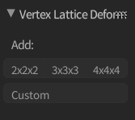
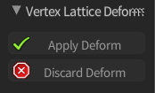

# Vertex Lattice Deform

This Blender Add-on is for making it faster and easier to use the lattice deform
modifier on vertices, edges, and faces of an object.

## Compatibility

This plugin is known to work with the following versions of Blender (click them to download the correct release version):

- [2.79](https://github.com/nikkomiu/vertex_lattice_deform/archive/2.7.zip)
- [2.78](https://github.com/nikkomiu/vertex_lattice_deform/archive/2.7.zip)

## Installation

1. Click the Blender version above that corresponds to the Blender version that
    you are using to download the zipped release.
1. In Blender go to File -> User Preferences... -> Add-ons -> Install From File
1. Navigate to the location where the repo was downloaded and open the
    `vertex_lattice_deform-{version}.zip` file
1. Enable the add-on in the list of Installed add-ons
    (it is **3DView: Vertex Lattice Deform** in the list)

## Usage

This add-on has two parts of it's functionality; creating and applying.

### Creating

Creating a vertex lattice deform is done through the use of one of the buttons
in the Vertex Lattice Deform menu in the Tools tab of the Operator panel while
in Edit mode on a mesh.

The options in the Add list are:

- **2x2x2:** Creates a lattice object of 2U, 2V, 2W around the selected vertices
- **3x3x3:** Creates a lattice object of 3U, 3V, 3W around the selected vertices
- **4x4x4:** Creates a lattice object of 3U, 3V, 3W around the selected vertices
- **Custom:** Allows you to define a custom U,V,W set (min of 2, max of 64 per
    axis) for the lattice object that will be placed around the selected vertices

**Note:** Make sure you have vertices selected before pressing the buttons as it is
designed to work on 2 or more selected vertices in the 3D viewport.

What it does behind the scenes:

1. Creates a vertex group on the current object with the selected vertices (the
    vertex group that is created is called  **Vertex_Lattice** and subsequently
    **Vertex_Lattice_001**)
1. Creates a Lattice object around the vertices that are selected
1. Adds a Lattice modifier to the object with the vertex group and the lattice
    object
1. Goes into Edit mode on the Lattice object

### Applying

While in edit mode of the lattice object that was created a new menu will appear
called Vertex Lattice Deform in the Tools tab of the Operator panel.

The options in the Vertex Lattice Deform menu are:

- **Apply Deform:** Applies the changes that were made on the lattice to the
    object
- **Discard Deform:** Discards the changes that were made to the lattice deform

What it does behind the scenes:

1. Either applies or removes the modifier on the object (based on the option
    selected)
1. Deletes the vertex group that was created
1. Deletes the lattice object that was created
1. Returns to edit mode on the object

**Note:** You should use the options on the lattice for applying the modifiers
  instead of manually applying the modifier on your object. This way the
  vertex lattice deform will clean up the vertex group and the lattice object.
